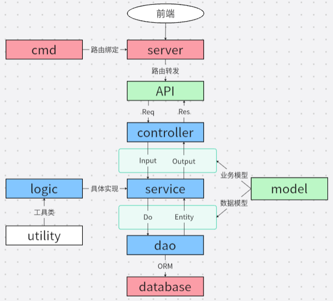

# 小羊试驾SheeDrive_开发文档


> 本文档建立于 2024-01-25 ，用于记录本人毕业设计的开发过程

## 快速体验
0. 准备 Go 语言和 GoFrame 的开发环境，同时需要保证 MySQL 和 Redis 数据库的开放

1. 从 github 克隆项目代码到你的`GOPATH`的`src`目录下
```bash
# https
git clone https://github.com/1354478648/SheeDrive.git
# ssh
git clone git@github.com:1354478648/SheeDrive.git
```

2. 使用 MySQL 创建名为`sheedrive`的数据库，字符集采用`utf8mb4_general_ci`，具体如图：


3. 在项目代码中找到`custom/sql`目录，运行`SheeDrive.sql`SQL脚本，创建项目所需的数据表和初始化数据

4. 在项目代码中找到`manifest`目录，创建`config/config.yaml`配置文件，并配置数据库连接等内容，示例配置如下：
```yaml
server:
  address: ":8000"
  openapiPath: "/api.json"
  swaggerPath: "/swagger"

database:
  # link: "mysql:用户名:密码@tcp(MySQL数据库服务器IP地址:端口号)/数据库名?loc=Local&parseTime=true"
  link: "mysql:root:2002@tcp(127.0.0.1:3306)/sheedrive?loc=Local&parseTime=true"
  createdAt: "create_time"
  updatedAt: "update_time"
  deletedAt: "delete_time"
  debug: true

redis:
  default:
    # address: Redis数据库服务器IP地址:端口号
    address: 127.0.0.1:6379
    db: 0

logger:
  level: "all"
  stdout: true
```

5. 在项目目录下使用`gf run main.go`命令运行项目

## 后端接口开发过程（待补充）
本系统的后端使用基于 Go 语言的 GoFrame 框架开发
### 准备工作
#### 环境准备
下面简单介绍准备工作，详细操作省略：
1. 下载安装 Go 语言开发环境，并配置环境变量
2. 下载安装 GoFrame 框架
3. 使用 MySQL 创建名为`sheedrive`的数据库，字符集采用`utf8mb4_general_ci`
4. 运行 SQL 代码，创建项目所需的数据表和初始化数据

#### 创建项目
在`GOPATH`的`src`目录下使用如下命令初始化项目，指定项目名称`sheedrive`
```bash
gf init sheedrive -u
```

1. 使用 VSCode 打开项目，删除`api`、`controller`中自动生成的文件，删除`cmd.go`中默认的路由绑定

2. 添加依赖的库：`mysql`驱动和`jwt`
```bash
go get github.com/gogf/gf/contrib/drivers/mysql/v2
```
```bash
go get github.com/golang-jwt/jwt/v5
```

3. 在`main.go`中初始化导入`mysql`驱动 
```go
import (
    _ "github.com/gogf/gf/contrib/drivers/mysql/v2"
)
```

4. 在`manifest/config/config.yaml`中配置数据库连接
```yaml
database:
  link: "mysql:root:2002@tcp(127.0.0.1:3306)/sheedrive?loc=Local&parseTime=true"
```

#### 代码生成
数据库相关的操作与数据结构放在`dao`与`model`中。在GoFrame中，`dao`与`model`的内容可以自动生成
1. 在`hack/config.yaml`中配置`dao`
```yaml
gfcli:
  gen:
    dao:
      link: "mysql:root:2002@tcp(localhost:3306)/sheedrive?loc=Local&parseTime=True"
      tables: "admin,user,dealer,address,car_detail,stock,order,comment"
```
其中，`link`表示数据库连接的URL；`tables`表示需要生成的`dao`和`model`的数据表，多个表用逗号隔开

2. 在命令行中执行该命令生成`dao`和`model`的代码
```bash
gf gen dao
```

### 设计思想
在具体实现每个功能前，需要解释下本项目的设计思想，比如代码分层设计、数据模型设计等等。当然，绝大多数还是需要基于官方文档的说明，但是官方文档又很少提供示例代码，编写标准好用的接口缺少参考，因此最终还是结合官方文档和社区示例项目代码才真正使本项目具有规范的设计思想

基于官方文档提供的代码分层、数据模型、业务模型等说明，本系统的总体设计框架如下图所示：



### 管理员相关接口
管理员相关接口共11个，包括：登录、分页关键字查询、通过ID查询、添加、删除、信息修改、状态切换、密码修改、密码重置
#### 登录
1. 编写 API 数据结构

  请求结构体使用`g.Meta`定义接口路径和请求方法，再定义请求参数，其中`p`标签用于自定义映射规则(比如前端发来名为`username`的参数可以映射为`Username`，但通常 GoFrame 自带的映射规则已经足够使用)，`v`标签用于指定参数校验规则，更多校验规则可以查看官方文档：

  > https://goframe.org/pages/viewpage.action?pageId=1114367

  响应结构体使用`json`标签将返回数据以指定的json格式传给前端

  `api/admin/admin.go`
```go
// 管理员登录
type AdminLoginReq struct {
	g.Meta   `path:"/login" method:"post"`
	Username string `p:"username" v:"required#请输入用户名" dc:"用户名"`
	Password string `p:"password" v:"required#请输入密码" dc:"密码"`
}

type AdminLoginRes struct {
	Token     string              `json:"token" dc:"验证token"`
	AdminInfo model.AdminInfoBase `json:"admin_info" dc:"管理员信息"`
}
```

2. 编写控制层框架及路由绑定，控制层方法使用规范路由的写法
`internal/controller/admin/admin.go`
```go
package admin

import (
	apiAdmin "SheeDrive/api/admin"
	apiPagination "SheeDrive/api/pagination"
	"SheeDrive/internal/model"
	"SheeDrive/internal/service"
	"SheeDrive/utility"
	"context"
)

var AdminController = &cAdmin{}

type cAdmin struct{}

// 管理员登录
func (c *cAdmin) AdminLogin(ctx context.Context, req *apiAdmin.AdminLoginReq) (res *apiAdmin.AdminLoginRes, err error) {
	return
}
```
`internal/cmd/cmd.go`

```go
group.Group("/admin", func(group *ghttp.RouterGroup) {
	group.Bind(admin.AdminController)
})
```

3. 设计管理员的业务层框架
`internal/service/admin.go`
```go
package service

import (
	"SheeDrive/internal/model"
	"context"
)

// 1. 定义接口
type IAdmin interface {
	Login(ctx context.Context, in model.AdminLoginInput) (out *model.AdminLoginOutput, err error)
}

// 2. 定义接口变量
var localAdmin IAdmin

// 3. 定义获取接口实例的函数
func Admin() IAdmin {
	if localAdmin == nil {
		panic("接口IAdmin未实现或未注册")
	}
	return localAdmin
}

// 4. 定义接口实现的注册方法
func RegisterAdmin(i IAdmin) {
	localAdmin = i
}
```

4. 定义业务模型
此处并不希望将敏感数据，比如密码也返回给前端，因此我们可以额外地自定义实体类模型来指定返回的字段
`internal/model/admin.go`
```go
// 管理员信息基类
type AdminInfoBase struct {
	Id       int64  `json:"id"         ` // 主键ID
	Name     string `json:"name"       ` // 姓名
	Username string `json:"username"   ` // 用户名
	// Password   string      `json:"password"   ` // 密码
	Avatar     string      `json:"avatar"     ` // 头像
	Phone      string      `json:"phone"      ` // 手机号
	Status     int         `json:"status"     ` // 状态 0:禁用, 1:正常
	IsRoot     int         `json:"isRoot"     ` // 是否是超级管理员 0:否, 1:是
	CreateTime *gtime.Time `json:"createTime" ` // 创建时间
	UpdateTime *gtime.Time `json:"updateTime" ` // 更新时间
	DeleteTime *gtime.Time `json:"deleteTime" ` // 删除时间
}

// AdminLoginInput 管理员登录
type AdminLoginInput struct {
	Username string
	Password string
}

// AdminLoginOutput 管理员登录结果
type AdminLoginOutput struct {
	AdminInfoBase
}
```

5. 实现业务接口
`internal/logic/admin/admin.go`
```go
package admin

import (
	"SheeDrive/internal/consts"
	"SheeDrive/internal/dao"
	"SheeDrive/internal/model"
	"SheeDrive/internal/model/do"
	"SheeDrive/internal/service"
	"SheeDrive/utility"
	"context"

	"github.com/gogf/gf/v2/errors/gerror"
)

type iAdmin struct{}

func New() *iAdmin {
	return &iAdmin{}
}

func init() {
	service.RegisterAdmin(New())
}

// Login implements service.IAdmin.
func (*iAdmin) Login(ctx context.Context, in model.AdminLoginInput) (out *model.AdminLoginOutput, err error) {
	// 实例化响应结构体
	out = &model.AdminLoginOutput{}

	err = dao.Admin.Ctx(ctx).Where(do.Admin{
		Username: in.Username,
		Password: utility.EncryptPassword(in.Password),
	}).Scan(&out.AdminInfoBase)
	if err != nil {
		return nil, gerror.New("用户名或密码不正确")
	}

	// 判断管理员状态是否被禁用
	if out.AdminInfoBase.Status == 0 {
		return nil, gerror.New("该管理员已被禁用")
	}

	return
}
```
其中，定义了工具类`EncryptPassword`，具体内容如下：
```go
package utility

import "github.com/gogf/gf/crypto/gmd5"

// 密码加密（不加盐）
func EncryptPassword(password string) string {
	return gmd5.MustEncryptString(gmd5.MustEncryptString(password))
}
```

6. 对接口实现进行初始化导入
`internal/logic/logic.go`
```go
package logic

import (
	_ "SheeDrive/internal/logic/admin"
)
```
在`main.go`中对`logic`进行初始化导入
```go
import (
    _ "gfbook/internal/logic"
)
```

7. 完成控制层代码
`internal/controller/admin/admin.go`
```go
// 管理员登录
func (c *cAdmin) AdminLogin(ctx context.Context, req *apiAdmin.AdminLoginReq) (res *apiAdmin.AdminLoginRes, err error) {
	// 调用Service层接口
	admin, err := service.Admin().Login(ctx, model.AdminLoginInput{
		Username: req.Username,
		Password: req.Password,
	})
	// 返回Token和管理员基本信息
	if err != nil {
		return nil, err
	}
	res = &apiAdmin.AdminLoginRes{
		Token:     utility.GenToken(admin.Username),
		AdminInfo: admin.AdminInfoBase,
	}
	return
}
```
其中，定义了工具类`GenToken`用于生成Token，具体代码如下（需要导入`jwt`）：
```go
import (
	"SheeDrive/internal/consts"
	"time"

	"github.com/golang-jwt/jwt/v5"
)

// 生成Token
func GenToken(username string) string {
	claim := jwt.RegisteredClaims{
		Subject: username,
		// 设置过期时间
		ExpiresAt: jwt.NewNumericDate(time.Now().Add(time.Hour * 24)),
	}

	token, err := jwt.NewWithClaims(jwt.SigningMethodHS256, claim).SignedString([]byte(consts.JwtTokenKey))

	if err != nil {
		panic("Token生成错误！")
	}

	return token
}
```
`JwtTokenKey`从常量中获取，是字符串即可

8. 添加登录验证中间件
`internal/service/middware.go`
```go
import "github.com/gogf/gf/v2/net/ghttp"

type IMiddleware interface {
	Auth(r *ghttp.Request)
}

var localMiddleware IMiddleware

func Middleware() IMiddleware {
	if localMiddleware == nil {
		panic("IMiddleware接口未实现或未注册")
	}
	return localMiddleware
}

func RegisterMiddleware(i IMiddleware) {
	localMiddleware = i
}
```
`internal/logic/middleware/middleware.go`
```go
import (
	"SheeDrive/internal/consts"
	"SheeDrive/internal/service"

	"github.com/gogf/gf/v2/net/ghttp"
	"github.com/golang-jwt/jwt/v5"
)

type iMiddleware struct{}

func New() *iMiddleware { return &iMiddleware{} }

func init() {
	service.RegisterMiddleware(New())
}

// Auth implements service.IMiddleware.
func (*iMiddleware) Auth(r *ghttp.Request) {
	var res *ghttp.DefaultHandlerResponse
	tokenStr := r.Header.Get("Authorization")
	if tokenStr == "" {
		res = &ghttp.DefaultHandlerResponse{
			Code:    403,
			Message: "请先登录",
		}
	} else {
		token, err := jwt.Parse(tokenStr, func(t *jwt.Token) (interface{}, error) {
			return []byte(consts.JwtTokenKey), nil
		})

		if err != nil || !token.Valid {
			res = &ghttp.DefaultHandlerResponse{
				Code:    403,
				Message: "身份验证已过期，请重新登录",
			}
		}
	}
	if res != nil {
		r.Response.WriteJsonExit(res)
	}
	r.Middleware.Next()
}
```
`internal/logic/logic.go`
```go
package logic

import (
	_ "SheeDrive/internal/logic/admin"
	_ "SheeDrive/internal/logic/middleware"
)
```

为了便于测试，我们在开发完所有接口后再绑定中间件

#### 分页关键字查询


### 文件上传接口
本系统借助阿里云 OSS 对象存储来完成文件的上传功能

#### 开通服务
登录阿里云平台，在产品中找到对象存储 OSS后，进入管理控制台创建 Bucket，参考设置如下：


#### 安装SDK
1. 使用源码方式安装 SDK
```bash
go get github.com/aliyun/aliyun-oss-go-sdk/oss
```

2. 运行以下代码查看 OSS Go SDK 的版本：
```go
package main

import (
  "fmt"
  "github.com/aliyun/aliyun-oss-go-sdk/oss"
)

func main() {
  fmt.Println("OSS Go SDK Version: ", oss.Version)
}
```

#### 配置访问凭证
配置短期访问凭证对于个人开发者而言维护成本较高，因此使用长期访问凭证

1. 登录阿里云账户，通过以下步骤创建 RAM 用户，获取 AccessKey ID 和 AccessKey Secret

> https://help.aliyun.com/zh/ram/user-guide/create-an-accesskey-pair#section-rjh-18m-7kp

2. 为了避免访问秘钥暴露到像 Github 之类的公开网站，需要将访问秘钥配置到环境变量里

① 打开命令行

② 执行以下命令配置RAM用户的访问密钥
```bash
set OSS_ACCESS_KEY_ID=
set OSS_ACCESS_KEY_SECRET=
```

③ 执行以下命令以使更改生效
```bash
setx OSS_ACCESS_KEY_ID "%OSS_ACCESS_KEY_ID%"
setx OSS_ACCESS_KEY_SECRET "%OSS_ACCESS_KEY_SECRET%"
```

④ 执行以下命令验证环境变量配置
```bash
echo %OSS_ACCESS_KEY_ID%
echo %OSS_ACCESS_KEY_SECRET%
```

参考过程如下：


3. 由于之前创建了私有 Bucket，需要将读写权限开放给自己的 RAM 用户


#### 创建存储空间
1. 在`utility`中创建工具类`aliOSS.go`，仿照官方文档提供的示例代码，将创建`OSSClient`实例的代码抽离出来做局部方法
```go
import (
	"SheeDrive/internal/consts"
	"fmt"
	"os"

	"github.com/aliyun/aliyun-oss-go-sdk/oss"
)

func handleError(err error) {
	fmt.Println("Error:", err)
	os.Exit(-1)
}

// 创建OSSClient实例
func initOSSClient() (bucket *oss.Bucket, err error) {
	// 存储空间名称
	bucketName := consts.BucketName

	// 从环境变量中获取访问凭证
	provider, err := oss.NewEnvironmentVariableCredentialsProvider()
	if err != nil {
		handleError(err)
	}

	// 创建OSSClient实例。
	// Endpoint
	client, err := oss.New("https://"+consts.EndpointName, "", "", oss.SetCredentialsProvider(&provider))
	if err != nil {
		handleError(err)
	}

	// 获取存储空间
	bucket, err = client.Bucket(bucketName)
	if err != nil {
		handleError(err)
	}

	return
}
```

其中，存储空间名称和地域节点名称可以从阿里云OSS控制台中找到，这里将其定义在`consts`中

#### 实现上传接口
GoFrame 提供了非常方便的表单文件上传功能，下面使用规范路由的形式接收上传文件

1. 定义API接口
```go
import (
	"github.com/gogf/gf/v2/frame/g"
	"github.com/gogf/gf/v2/net/ghttp"
)

type FileUploadReq struct {
	g.Meta `path:"/upload" method:"post" mime:"multipart/form-data"`
	File   *ghttp.UploadFile `p:"file" type:"file" dc:"上传文件"`
}

type FileUploadRes struct {
	Url string `json:"url" dc:"文件路径"`
}
```
参数接收的数据类型使用`*ghttp.UploadFile`

2. 实现控制层接口
```go
import (
	apiFile "SheeDrive/api/file"
	"SheeDrive/internal/consts"
	"SheeDrive/utility"
	"context"
	"os"
	"path"

	"github.com/gogf/gf/v2/errors/gcode"
	"github.com/gogf/gf/v2/errors/gerror"
)

var FileController = &cFile{}

type cFile struct{}

// 单文件上传
func (c *cFile) FileUpload(ctx context.Context, req *apiFile.FileUploadReq) (res *apiFile.FileUploadRes, err error) {
	const (
		tempLocalPath    = consts.TempLocalPath
		imagesObjectName = consts.ImagesObjectName
	)

	// 获取文件
	file := req.File
	// 判断文件是否为空
	if file == nil {
		return nil, gerror.NewCode(gcode.CodeMissingParameter, "请选择需要上传的文件")
	}

	// 生成UUID防止文件重名
	// path.Ext方法能够获取文件扩展名
	file.Filename = utility.GenStrUUID() + path.Ext(file.Filename)

	// 先将文件临时存到本地中
	fileName, err := file.Save(tempLocalPath)
	if err != nil {
		return nil, err
	}

	url := utility.UploadFile(imagesObjectName+fileName, tempLocalPath+fileName)

	// 删除本地临时文件
	err = os.RemoveAll(tempLocalPath)
	if err != nil {
		return nil, err
	}

	// 定义返回结构体
	res = &apiFile.FileUploadRes{
		Url: url,
	}

	return
}
```
其中两个常量：`TempLocalPath`表示本地临时文件存储的路径，可以放在`temp/`里，由于该路径在`.gitignore`中，能够防止被 Git 上传到公开网站中；`ImagesObjectName`表示文件存储在 OSS 存储空间的目标路径，可以写根路径

另外在工具类中定义了生成 UUID 的方法，内容如下：
```go
import (
	"github.com/google/uuid"
)

func GenStrUUID() (id string) {
	id = uuid.New().String()
	return
}

func GenIntUUID() (id int64) {
	id = int64(uuid.New().ID())
	return
}
```
需要先在终端中输入命令安装外部库
```bash
go get github.com/google/uuid
```

3. 参考官方文档的示例代码，具体实现上传文件工具类接口
```go
// 上传文件
func UploadFile(objectName, localFileName string) (url string) {
	bucket, err := initOSSClient()
	if err != nil {
		handleError(err)
	}
	err = bucket.PutObjectFromFile(objectName, localFileName)
	if err != nil {
		handleError(err)
	}
	url = fmt.Sprintf("https://%s.%s/%s", consts.BucketName, consts.EndpointName, objectName)
	return
}
```
`PutObjectFromFile`方法需要两个参数，第一个是存储空间的目标存储路径，第二个是本地文件路径

最后，返回的`url`是有规律的，可以通过拼接的方式获取

#### 路由绑定
`internal/cmd/cmd.go`

```go
group.Group("/file", func(group *ghttp.RouterGroup) {
	group.Bind(file.FileController)
})
```

### Redis 缓存优化
#### 安装与配置
在 Goframe 中，通过`gredis`组件实现 Redis 客户端。在项目中引入 Redis：
1. 安装
```bash
go get -u github.com/gogf/gf/contrib/nosql/redis/v2
```
2. 引用
```go
import (
	_ "github.com/gogf/gf/contrib/nosql/redis/v2"

	// other imported packages.
)
```
3. 在`config.yaml`中配置 Redis：
```yaml
redis:
  default:
    address: 127.0.0.1:6379
    db: 1
```
其中`default`表示配置分组名称，在程序中通过该名称获取对应配置的`redis`单例对象。不传递分组名称时，默认使用`redis.default`来获取。

其他配置项（比如密码、连接最大空闲时间等）参考官方文档：

> https://goframe.org/pages/viewpage.action?pageId=1114217


### 短信验证码登录(模拟)
阿里云短信服务需要付费，并且需要等待较长的审批流程，因此这里选择模拟发送短信验证码的方式登录账号


