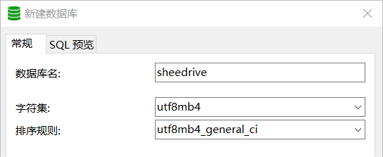
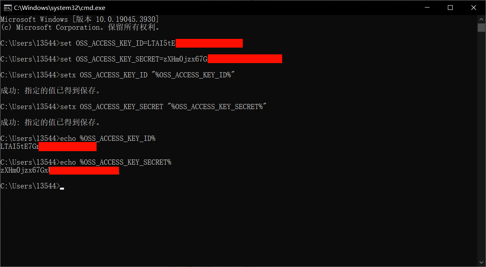

# 小羊试驾SheeDrive_开发文档


> 本文档建立于 2024-01-25 ，用于记录本人毕业设计的开发过程

## 快速体验
0. 准备 Go 语言和 GoFrame 的开发环境

1. 从 github 克隆项目代码到你的`GOPATH`的`src`目录下
```bash
# https
git clone https://github.com/1354478648/SheeDrive.git
# ssh
git clone git@github.com:1354478648/SheeDrive.git
```

2. 使用 MySQL 创建名为`sheedrive`的数据库，字符集采用`utf8mb4_general_ci`



3. 在项目代码中找到`custom/sql`目录，运行`SheeDrive.sql`SQL脚本，创建项目所需的数据表和初始化数据

4. 在项目代码中找到`manifest`目录，创建`config/config.yaml`配置文件，并配置数据库连接等内容，示例配置如下：
```yaml
server:
  address: ":8000"
  openapiPath: "/api.json"
  swaggerPath: "/swagger"

database:
  link: "mysql:root:2002@tcp(127.0.0.1:3306)/sheedrive?loc=Local&parseTime=true"
  createdAt: "create_time"
  updatedAt: "update_time"
  deletedAt: "delete_time"

logger:
  level: "all"
  stdout: true
```

5. 在项目目录下使用`gf run main.go`命令运行项目

## 后端接口开发过程
本系统的后端使用基于 Go 语言的 GoFrame 框架开发
### 准备工作
#### 环境准备
下面简单介绍准备工作，详细操作省略：
1. 下载安装 Go 语言开发环境，并配置环境变量
2. 下载安装 GoFrame 框架
3. 使用 MySQL 创建名为`sheedrive`的数据库，字符集采用`utf8mb4_general_ci`
4. 运行如下 SQL 代码，创建项目所需的数据表和初始化数据

```sql
USE `sheedrive`;

SET FOREIGN_KEY_CHECKS=0;

/*Table structure for table `admin` */
DROP TABLE IF EXISTS `admin`;
CREATE TABLE `admin` (
  `id` bigint(20) NOT NULL AUTO_INCREMENT COMMENT '主键ID',
  `name` varchar(32) COLLATE utf8_bin NOT NULL COMMENT '姓名',
  `username` varchar(32) COLLATE utf8_bin NOT NULL COMMENT '用户名',
  `password` varchar(64) COLLATE utf8_bin NOT NULL COMMENT '密码',
  `avatar` varchar(500) COLLATE utf8_bin DEFAULT NULL COMMENT '头像',
  `phone` varchar(11) COLLATE utf8_bin NOT NULL COMMENT '手机号',
  `status` int(11) NOT NULL DEFAULT '1' COMMENT '状态 0:禁用, 1:正常',
  `create_time` datetime NOT NULL COMMENT '创建时间',
  `update_time` datetime NOT NULL COMMENT '更新时间',
  `delete_time` datetime DEFAULT NULL COMMENT '删除时间',
  `create_user` bigint(20) NOT NULL COMMENT '创建人',
  `update_user` bigint(20) NOT NULL COMMENT '修改人',
  `delete_user` bigint(20) DEFAULT NULL COMMENT '删除人',
  PRIMARY KEY (`id`) USING BTREE,
  UNIQUE INDEX `idx_username` (`username`)
) ENGINE=InnoDB DEFAULT CHARSET=utf8 COLLATE=utf8_bin COMMENT='管理员信息';

INSERT INTO `admin` VALUES (1, '超级管理员', 'admin', '123456', null, '13001801111', 1, NOW(), NOW(), null, 1, 1, null);
INSERT INTO `admin` VALUES (2, '超级管理员2', 'admin2', '123456', null, '13001802222', 1, NOW(), NOW(), null, 1, 1, null);

/*Table structure for table `user` */
DROP TABLE IF EXISTS `user`;
CREATE TABLE `user` (
  `id` bigint(20) NOT NULL COMMENT '主键ID',
  `last_name` varchar(32) COLLATE utf8_bin NOT NULL COMMENT '姓',
  `first_name` varchar(32) COLLATE utf8_bin NOT NULL COMMENT '名',
  `username` varchar(32) COLLATE utf8_bin NOT NULL COMMENT '用户名',
  `password` varchar(64) COLLATE utf8_bin NOT NULL COMMENT '密码',
  `avatar` varchar(500) COLLATE utf8_bin DEFAULT NULL COMMENT '头像',
  `phone` varchar(11) COLLATE utf8_bin NOT NULL COMMENT '手机号',
  `id_number` varchar(18) COLLATE utf8_bin NOT NULL COMMENT '身份证号',
  `sex` varchar(2) COLLATE utf8_bin DEFAULT NULL COMMENT '性别',
  `birthday` datetime DEFAULT NULL COMMENT '生日',
  `status` int(11) NOT NULL DEFAULT '1' COMMENT '状态 0:禁用, 1:正常',
  `create_time` datetime NOT NULL COMMENT '创建时间',
  `update_time` datetime NOT NULL COMMENT '更新时间',
  `delete_time` datetime DEFAULT NULL COMMENT '删除时间',
  `create_user` bigint(20) NOT NULL COMMENT '创建人',
  `update_user` bigint(20) NOT NULL COMMENT '修改人',
  `delete_user` bigint(20) DEFAULT NULL COMMENT '删除人',
  PRIMARY KEY (`id`) USING BTREE,
  UNIQUE INDEX `idx_username` (`username`)
) ENGINE=InnoDB DEFAULT CHARSET=utf8 COLLATE=utf8_bin COMMENT='用户信息';

INSERT INTO `user` VALUES (1, '汤', '日成', '15001807369', '123456', null, '15001807369', '310115200207179212', '男', '2002-07-17', '1', NOW(), NOW(), null, 1, 1, null);
INSERT INTO `user` VALUES (2, '张', '三', '15001801111', '123456', null, '15001801111', '310115200101011111', '男', '2001-01-01', '1', NOW(), NOW(), null, 1, 1, null);
INSERT INTO `user` VALUES (3, '李', '四', '15001802222', '123456', null, '15001802222', '310115200101022222', '女', '2002-01-02', '1', NOW(), NOW(), null, 1, 1, null);
INSERT INTO `user` VALUES (4, '王', '五', '15001803333', '123456', null, '15001803333', '310115200101031111', '男', '2002-01-03', '1', NOW(), NOW(), null, 1, 1, null);
INSERT INTO `user` VALUES (5, '赵', '六', '15001804444', '123456', null, '15001804444', '310115200101042222', '女', '2002-01-04', '1', NOW(), NOW(), null, 1, 1, null);

/*Table structure for table `dealer` */
DROP TABLE IF EXISTS `dealer`;
CREATE TABLE `dealer`(
  `id` bigint(20) NOT NULL AUTO_INCREMENT COMMENT '主键ID',
  `name` varchar(32) COLLATE utf8_bin NOT NULL COMMENT '名称',
  `username` varchar(32) COLLATE utf8_bin NOT NULL COMMENT '用户名',
  `password` varchar(64) COLLATE utf8_bin NOT NULL COMMENT '密码',
  `avatar` varchar(500) COLLATE utf8_bin DEFAULT NULL COMMENT '头像',
  `phone` varchar(11) COLLATE utf8_bin NOT NULL COMMENT '手机号',
  `describe_info` varchar(255) COLLATE utf8_bin DEFAULT NULL COMMENT '描述信息',
  `status` int(11) NOT NULL DEFAULT '1' COMMENT '状态 0:禁用, 1:正常',
  `create_time` datetime NOT NULL COMMENT '创建时间',
  `update_time` datetime NOT NULL COMMENT '更新时间',
  `delete_time` datetime DEFAULT NULL COMMENT '删除时间',
  `create_user` bigint(20) NOT NULL COMMENT '创建人',
  `update_user` bigint(20) NOT NULL COMMENT '修改人',
  `delete_user` bigint(20) DEFAULT NULL COMMENT '删除人',
  PRIMARY KEY (`id`) USING BTREE,
  UNIQUE INDEX `idx_username` (`username`)
) ENGINE=InnoDB DEFAULT CHARSET=utf8 COLLATE=utf8_bin COMMENT='经销商信息';

INSERT INTO `dealer` VALUES (1, '上海子鼠汽车', 'zishu', '123456', null, '15001801111', '五星经销商，好评不断！', 1, NOW(), NOW(), null, 1, 1, null);
INSERT INTO `dealer` VALUES (2, '上海丑牛汽车', 'chouniu', '123456', null, '15001802222', '百万客户，好评连连！', 1, NOW(), NOW(), null, 1, 1, null);
INSERT INTO `dealer` VALUES (3, '上海寅虎汽车', 'yinhu', '123456', null, '15001803333', '您身边的汽车管家！', 1, NOW(), NOW(), null, 1, 1, null);
INSERT INTO `dealer` VALUES (4, '上海卯兔汽车', 'maotu', '123456', null, '15001804444', '尊享服务，就在你家门口！', 1, NOW(), NOW(), null, 1, 1, null);
INSERT INTO `dealer` VALUES (5, '上海辰龙汽车', 'chenlong', '123456', null, '15001805555', '优质好车，选择辰龙！', 1, NOW(), NOW(), null, 1, 1, null);

/*Table structure for table `address` */
DROP TABLE IF EXISTS `address`;
CREATE TABLE `address` (
  `id` bigint(20) NOT NULL COMMENT '主键ID',
  `belong_id` bigint(20) NOT NULL COMMENT '所属ID',
  `belong_category` int(11) NOT NULL COMMENT '所属分类 1:经销商,2:用户',
  `latitude` double NOT NULL COMMENT '纬度',
  `longitude` double NOT NULL COMMENT '经度',
  `accuracy` double NOT NULL COMMENT '精度',
  `country` varchar(255) COLLATE utf8_bin DEFAULT NULL COMMENT '国家',
  `province` varchar(255) COLLATE utf8_bin DEFAULT NULL COMMENT '省',
  `city` varchar(255) COLLATE utf8_bin DEFAULT NULL COMMENT '市',
  `district` varchar(255) COLLATE utf8_bin DEFAULT NULL COMMENT '区',
  `street` varchar(255) COLLATE utf8_bin DEFAULT NULL COMMENT '街道',
  `street_number` varchar(255) COLLATE utf8_bin DEFAULT NULL COMMENT '门牌号',
  `poi_name` varchar(255) COLLATE utf8_bin DEFAULT NULL COMMENT 'POI信息',
  `postal_code` varchar(255) COLLATE utf8_bin DEFAULT NULL COMMENT '邮政编码',
  `city_code` varchar(255) COLLATE utf8_bin DEFAULT NULL COMMENT '城市代码',
  `create_time` datetime NOT NULL COMMENT '创建时间',
  `update_time` datetime NOT NULL COMMENT '更新时间',
  `delete_time` datetime DEFAULT NULL COMMENT '删除时间',
  `create_user` bigint(20) NOT NULL COMMENT '创建人',
  `update_user` bigint(20) NOT NULL COMMENT '修改人',
  `delete_user` bigint(20) DEFAULT NULL COMMENT '删除人',
  PRIMARY KEY (`id`) USING BTREE
) ENGINE=InnoDB DEFAULT CHARSET=utf8 COLLATE=utf8_bin COMMENT='地址簿';

/*Table structure for table `car_detail` */
DROP TABLE IF EXISTS `car_detail`;
CREATE TABLE `car_detail` (
  `id` bigint(20) NOT NULL AUTO_INCREMENT COMMENT '主键ID',
  `year` year NOT NULL COMMENT '年份',
  `brand` varchar(255) COLLATE utf8_bin NOT NULL COMMENT '品牌',
  `model` varchar(255) COLLATE utf8_bin NOT NULL COMMENT '型号',
  `version` varchar(255) COLLATE utf8_bin NOT NULL COMMENT '版本',
  `image` varchar(500) COLLATE utf8_bin DEFAULT NULL COMMENT '图片',
  `category` int(11) NOT NULL COMMENT '类型 0:其他, 1:轿车, 2:SUV, 3:MPV, 4:卡车, 5:跑车',
  `color` varchar(255) COLLATE utf8_bin NOT NULL COMMENT '颜色',
  `price` bigint(20) NOT NULL COMMENT '指导价',
  `type` int(11) NOT NULL COMMENT '类型 0:其他, 1:纯电动, 2:插电混动, 3:增程, 4:汽油, 5:汽油+48V轻混系统, 6:油电混动, 7:柴油',
  `seats` int(11) NOT NULL COMMENT '座位数 0:7座以上 1:1座, 2:2座, 4:4座, 5:5座, 6:6座, 7:7座',
  `describe_info` varchar(255) COLLATE utf8_bin DEFAULT NULL COMMENT '描述信息',
  `create_time` datetime NOT NULL COMMENT '创建时间',
  `update_time` datetime NOT NULL COMMENT '更新时间',
  `delete_time` datetime DEFAULT NULL COMMENT '删除时间',
  `create_user` bigint(20) NOT NULL COMMENT '创建人',
  `update_user` bigint(20) NOT NULL COMMENT '修改人',
  `delete_user` bigint(20) DEFAULT NULL COMMENT '删除人',
  PRIMARY KEY (`id`) USING BTREE
) ENGINE=InnoDB DEFAULT CHARSET=utf8 COLLATE=utf8_bin COMMENT='汽车细节表';

INSERT INTO `car_detail` VALUES (1, 2024, '大众', '帕萨特', '商务版', null, '1', '黑', 181900, 4, 5, '2023款 大众帕萨特 280TSI 商务版', NOW(), NOW(), null, 1, 1, null);
INSERT INTO `car_detail` VALUES (2, 2024, '大众', '帕萨特', '豪华版', null, '1', '黑', 227300, 4, 5, '2023款 大众帕萨特 380TSI 豪华版', NOW(), NOW(), null, 1, 1, null);
INSERT INTO `car_detail` VALUES (3, 2024, '奥迪', 'A6L', '45 TFSI 甄选致雅版', null, '1', '黑', 454900, 4, 5, '2023款 奥迪A6L 45 TFSI 甄选致雅版', NOW(), NOW(), null, 1, 1, null);
INSERT INTO `car_detail` VALUES (4, 2024, '奥迪', 'A6L', '55 TFSI quattro 旗舰致雅型', null, '1', '黑', 656800, 4, 5, '2023款 奥迪A6L 55 TFSI quattro 旗舰致雅型', NOW(), NOW(), null, 1, 1, null);
INSERT INTO `car_detail` VALUES (5, 2024, '保时捷', 'Cayenne', '3.0T', null, '2', '白', 948000, 4, 5, '2024款 保时捷 Cayenne 3.0T', NOW(), NOW(), null, 1, 1, null);
INSERT INTO `car_detail` VALUES (6, 2023, '本田', '雅阁', '卓越版', null, '1', '黑', 213800, 4, 5, '2023款 本田雅阁 锐T动 260TURBO 卓越版', NOW(), NOW(), null, 1, 1, null);
INSERT INTO `car_detail` VALUES (7, 2023, '本田', '雅阁', '卓越版', null, '1', '灰', 213800, 4, 5, '2023款 本田雅阁 锐T动 260TURBO 卓越版', NOW(), NOW(), null, 1, 1, null);
INSERT INTO `car_detail` VALUES (8, 2023, '本田', 'CR-V', 'CVT两驱锋尚7座版', null, '2', '红', 208900, 4, 7, '2023款 本田CR-V 240TURBO CVT 两驱锋尚7座版', NOW(), NOW(), null, 1, 1, null);
INSERT INTO `car_detail` VALUES (9, 2023, '理想', 'L9', 'Pro', null, '2', '银', 429800, 3, 7, '2023款 理想L9 Pro', NOW(), NOW(), null, 1, 1, null);
INSERT INTO `car_detail` VALUES (10, 2022, '理想', 'L9', 'Max', null, '2', '银', 459800, 3, 7, '2022款 理想L9 Max', NOW(), NOW(), null, 1, 1, null);

/*Table structure for table `stock` */
DROP TABLE IF EXISTS `stock`;
CREATE TABLE `stock` (
  `id` bigint(20) NOT NULL AUTO_INCREMENT COMMENT '主键ID',
  `dealer_id` bigint(20) NOT NULL COMMENT '经销商ID',
  `car_id` bigint(20) NOT NULL COMMENT '车辆ID',
  `stock` int(11) NOT NULL COMMENT '库存数',
  `create_time` datetime NOT NULL COMMENT '创建时间',
  `update_time` datetime NOT NULL COMMENT '更新时间',
  `delete_time` datetime DEFAULT NULL COMMENT '删除时间',
  `create_user` bigint(20) NOT NULL COMMENT '创建人',
  `update_user` bigint(20) NOT NULL COMMENT '修改人',
  `delete_user` bigint(20) DEFAULT NULL COMMENT '删除人',
  PRIMARY KEY (`id`) USING BTREE
)ENGINE=InnoDB DEFAULT CHARSET=utf8 COLLATE=utf8_bin COMMENT='库存表';

INSERT INTO `stock` VALUES (1, 1, 1, 10, NOW(), NOW(), null, 1, 1, null);
INSERT INTO `stock` VALUES (2, 1, 2, 10, NOW(), NOW(), null, 1, 1, null);
INSERT INTO `stock` VALUES (3, 1, 3, 10, NOW(), NOW(), null, 1, 1, null);
INSERT INTO `stock` VALUES (4, 2, 4, 10, NOW(), NOW(), null, 1, 1, null);
INSERT INTO `stock` VALUES (5, 3, 5, 10, NOW(), NOW(), null, 1, 1, null);
INSERT INTO `stock` VALUES (6, 3, 6, 10, NOW(), NOW(), null, 1, 1, null);

/*Table structure for table `order` */
DROP TABLE IF EXISTS `order`;
CREATE TABLE `order` (
  `id` bigint(20) NOT NULL COMMENT '主键ID',
  `user_id` bigint(20) NOT NULL COMMENT '用户ID',
  `dealer_id` bigint(20) NOT NULL COMMENT '经销商ID',
  `car_id` bigint(20) NOT NULL COMMENT '车辆ID',
  `addr_id` bigint(20) NOT NULL COMMENT '用户地址ID',
  `status` int(11) NOT NULL DEFAULT '1' COMMENT '订单状态 -1:异常,0:取消,1:未确认,2:已确认,3:签署协议,4:试驾中,5:试驾结束,6:待评价,7:已评价',
  `create_time` datetime NOT NULL COMMENT '创建时间',
  `update_time` datetime NOT NULL COMMENT '更新时间',
  `delete_time` datetime DEFAULT NULL COMMENT '删除时间',
  `create_user` bigint(20) NOT NULL COMMENT '创建人',
  `update_user` bigint(20) NOT NULL COMMENT '修改人',
  `delete_user` bigint(20) DEFAULT NULL COMMENT '删除人',
  PRIMARY KEY (`id`) USING BTREE
)ENGINE=InnoDB DEFAULT CHARSET=utf8 COLLATE=utf8_bin COMMENT='订单表';

/*Table structure for table `comment` */
DROP TABLE IF EXISTS `comment`;
CREATE TABLE `comment` (
  `id` bigint(20) NOT NULL COMMENT '主键ID',
  `order_id` bigint(20) NOT NULL COMMENT '订单ID',
  `content` varchar(255) COLLATE utf8_bin NOT NULL COMMENT '评价内容',
  `total_score` int(11) NOT NULL COMMENT '总评分 1~5星',
  `dealer_score` int(11) NOT NULL COMMENT '经销商评分 1~5星',
  `car_score` int(11) NOT NULL COMMENT '汽车评分 1~5星',
  `create_time` datetime NOT NULL COMMENT '创建时间',
  `delete_time` datetime DEFAULT NULL COMMENT '删除时间',
  `create_user` bigint(20) NOT NULL COMMENT '创建人',
  `delete_user` bigint(20) DEFAULT NULL COMMENT '删除人',
  PRIMARY KEY (`id`) USING BTREE 
)ENGINE=InnoDB DEFAULT CHARSET=utf8 COLLATE=utf8_bin COMMENT='评价表';
```

#### 创建项目
在`GOPATH`的`src`目录下使用如下命令初始化项目，指定项目名称`sheedrive`
```bash
gf init sheedrive -u
```

1. 使用 VSCode 打开项目，删除`api`、`controller`中自动生成的文件，删除`cmd.go`中默认的路由绑定

2. 添加依赖的库：`mysql`驱动和`jwt`
```bash
go get github.com/gogf/gf/contrib/drivers/mysql/v2
```
```bash
go get github.com/golang-jwt/jwt/v5
```

3. 在`main.go`中初始化导入`mysql`驱动 
```go
import (
    _ "github.com/gogf/gf/contrib/drivers/mysql/v2"
)
```

4. 在`manifest/config/config.yaml`中配置数据库连接
```yaml
database:
  link: "mysql:root:2002@tcp(127.0.0.1:3306)/sheedrive?loc=Local&parseTime=true"
```

#### 代码生成
数据库相关的操作与数据结构放在`dao`与`model`中。在GoFrame中，`dao`与`model`的内容可以自动生成
1. 在`hack/config.yaml`中配置`dao`
```yaml
gfcli:
  gen:
    dao:
      link: "mysql:root:2002@tcp(localhost:3306)/sheedrive?loc=Local&parseTime=True"
      tables: "admin,user,dealer,address,car_detail,stock,order,comment"
```
其中，`link`表示数据库连接的URL；`tables`表示需要生成的`dao`和`model`的数据表，多个表用逗号隔开

2. 在命令行中执行该命令生成`dao`和`model`的代码
```bash
gf gen dao
```

### 管理员相关接口


### 文件上传接口
本系统借助阿里云 OSS 对象存储来完成文件的上传功能

#### 开通服务
登录阿里云平台，在产品中找到对象存储 OSS后，进入管理控制台创建 Bucket，参考设置如下：


#### 安装SDK
1. 使用源码方式安装 SDK
```bash
go get github.com/aliyun/aliyun-oss-go-sdk/oss
```

2. 运行以下代码查看 OSS Go SDK 的版本：
```go
package main

import (
  "fmt"
  "github.com/aliyun/aliyun-oss-go-sdk/oss"
)

func main() {
  fmt.Println("OSS Go SDK Version: ", oss.Version)
}
```

#### 配置访问凭证
配置短期访问凭证对于个人开发者而言维护成本较高，因此使用长期访问凭证

1. 登录阿里云账户，通过以下步骤创建 RAM 用户，获取 AccessKey ID 和 AccessKey Secret

> https://help.aliyun.com/zh/ram/user-guide/create-an-accesskey-pair#section-rjh-18m-7kp

2. 为了避免访问秘钥暴露到像 Github 之类的公开网站，需要将访问秘钥配置到环境变量里

① 打开命令行

② 执行以下命令配置RAM用户的访问密钥
```bash
set OSS_ACCESS_KEY_ID=
set OSS_ACCESS_KEY_SECRET=
```

③ 执行以下命令以使更改生效
```bash
setx OSS_ACCESS_KEY_ID "%OSS_ACCESS_KEY_ID%"
setx OSS_ACCESS_KEY_SECRET "%OSS_ACCESS_KEY_SECRET%"
```

④ 执行以下命令验证环境变量配置
```bash
echo %OSS_ACCESS_KEY_ID%
echo %OSS_ACCESS_KEY_SECRET%
```

参考过程如下：



3. 由于之前创建了私有 Bucket，需要将读写权限开放给自己的 RAM 用户


#### 创建存储空间
1. 在`utility`中创建工具类`aliOSS.go`，仿照官方文档提供的示例代码，将创建`OSSClient`实例的代码抽离出来做局部方法
```go
import (
	"SheeDrive/internal/consts"
	"fmt"
	"os"

	"github.com/aliyun/aliyun-oss-go-sdk/oss"
)

func handleError(err error) {
	fmt.Println("Error:", err)
	os.Exit(-1)
}

// 创建OSSClient实例
func initOSSClient() (bucket *oss.Bucket, err error) {
	// 存储空间名称
	bucketName := consts.BucketName

	// 从环境变量中获取访问凭证
	provider, err := oss.NewEnvironmentVariableCredentialsProvider()
	if err != nil {
		handleError(err)
	}

	// 创建OSSClient实例。
	// Endpoint
	client, err := oss.New("https://"+consts.EndpointName, "", "", oss.SetCredentialsProvider(&provider))
	if err != nil {
		handleError(err)
	}

	// 获取存储空间
	bucket, err = client.Bucket(bucketName)
	if err != nil {
		handleError(err)
	}

	return
}
```

其中，存储空间名称和地域节点名称可以从阿里云OSS控制台中找到，这里将其定义在`consts`中

#### 实现上传接口
GoFrame 提供了非常方便的表单文件上传功能，下面使用规范路由的形式接收上传文件

1. 定义API接口
```go
import (
	"github.com/gogf/gf/v2/frame/g"
	"github.com/gogf/gf/v2/net/ghttp"
)

type FileUploadReq struct {
	g.Meta `path:"/upload" method:"post" mime:"multipart/form-data"`
	File   *ghttp.UploadFile `p:"file" type:"file" dc:"上传文件"`
}

type FileUploadRes struct {
	Url string `json:"url" dc:"文件路径"`
}
```
参数接收的数据类型使用`*ghttp.UploadFile`

2. 实现控制层接口
```go
import (
	apiFile "SheeDrive/api/file"
	"SheeDrive/internal/consts"
	"SheeDrive/utility"
	"context"
	"os"
	"path"

	"github.com/gogf/gf/v2/errors/gcode"
	"github.com/gogf/gf/v2/errors/gerror"
)

var FileController = &cFile{}

type cFile struct{}

// 单文件上传
func (c *cFile) FileUpload(ctx context.Context, req *apiFile.FileUploadReq) (res *apiFile.FileUploadRes, err error) {
	const (
		tempLocalPath    = consts.TempLocalPath
		imagesObjectName = consts.ImagesObjectName
	)

	// 获取文件
	file := req.File
	// 判断文件是否为空
	if file == nil {
		return nil, gerror.NewCode(gcode.CodeMissingParameter, "请选择需要上传的文件")
	}

	// 生成UUID防止文件重名
	// path.Ext方法能够获取文件扩展名
	file.Filename = utility.GenStrUUID() + path.Ext(file.Filename)

	// 先将文件临时存到本地中
	fileName, err := file.Save(tempLocalPath)
	if err != nil {
		return nil, err
	}

	url := utility.UploadFile(imagesObjectName+fileName, tempLocalPath+fileName)

	// 删除本地临时文件
	err = os.RemoveAll(tempLocalPath)
	if err != nil {
		return nil, err
	}

	// 定义返回结构体
	res = &apiFile.FileUploadRes{
		Url: url,
	}

	return
}
```
其中两个常量：`TempLocalPath`表示本地临时文件存储的路径，可以放在`temp/`里，由于该路径在`.gitignore`中，能够防止被 Git 上传到公开网站中；`ImagesObjectName`表示文件存储在 OSS 存储空间的目标路径，可以写根路径

另外在工具类中定义了生成 UUID 的方法，内容如下：
```go
import (
	"github.com/google/uuid"
)

func GenStrUUID() (id string) {
	id = uuid.New().String()
	return
}

func GenIntUUID() (id int64) {
	id = int64(uuid.New().ID())
	return
}
```
需要先在终端中输入命令安装外部库
```bash
go get github.com/google/uuid
```

3. 参考官方文档的示例代码，具体实现上传文件工具类接口
```go
// 上传文件
func UploadFile(objectName, localFileName string) (url string) {
	bucket, err := initOSSClient()
	if err != nil {
		handleError(err)
	}
	err = bucket.PutObjectFromFile(objectName, localFileName)
	if err != nil {
		handleError(err)
	}
	url = fmt.Sprintf("https://%s.%s/%s", consts.BucketName, consts.EndpointName, objectName)
	return
}
```
`PutObjectFromFile`方法需要两个参数，第一个是存储空间的目标存储路径，第二个是本地文件路径

最后，返回的`url`是有规律的，可以通过拼接的方式获取

#### 路由绑定
`internal/cmd/cmd.go`

```go
group.Group("/file", func(group *ghttp.RouterGroup) {
	group.Bind(file.FileController)
})
```


